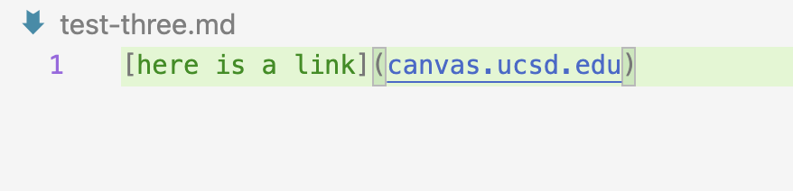

# Lab report 2

### Change 1

Code change:

Test file:

[link for test file](https://github.com/gingersmith4/markdown-parse/blob/main/test-three.md)

Symptom of failure inducing output:

Here the bug was an assumption that the program could always subtract one from the index of the OpenBracket, the symptom was helpful because it showed that the program was looking at index 0 and -1 so we knew to look for a subtraction. The failure-inducing input is pretty rare, just if the very first thing in the file is a link. It took awhile to find the bug since the currentIndex starts at 0.

### Change 2

Code change:

Test file:

[link for test file](second-test.md)

Symptom of failure inducing output:

Here the issue was that links without parentheses weren't being printed. Depending on the instructions for the program this could be a bug or we would want the "failure" because the link was not formatted correctly.

### Change 3

Code change:

Test file:

[link for test file](https://github.com/gingersmith4/markdown-parse/blob/main/test-four.md)

Symptom of failure inducing output:

In this case the symptom was very clear from the failure-inducing input, there were quotes around the link in the test file. Then it was simple to fix the bug by checking if the link started with and ended with quotes and if so shifting the index over.

[Back to home page](index.html)
